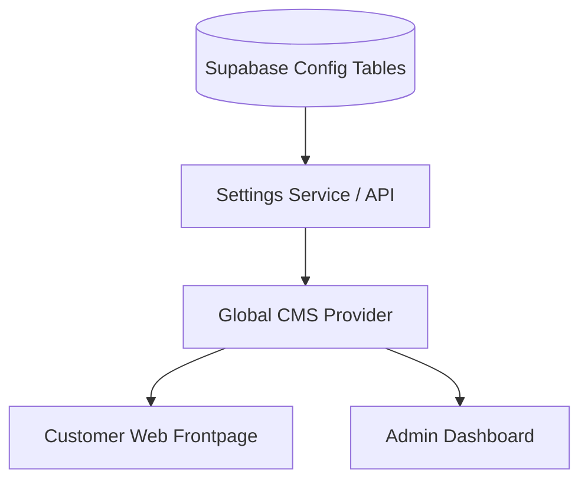
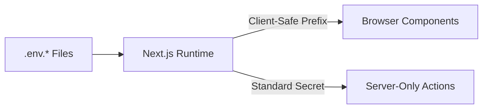

# GoldSA CMS: Final Technical Architecture & Design Foundation

This document defines the finalized technical architecture, folder structure, system modules, and design philosophies for **GoldSA CMS**—a premium, CMS-first jewelry platform built on a single unified Next.js codebase.

---

## 1. Project Vision & Scope

**GoldSA CMS** is designed as a reusable, highly configurable Headless CMS and Storefront solution for high-end jewelry stores. Rather than being hardcoded for a single boutique, the platform isolates layout configurations, media catalogs, pricing rules, and storefront styles from core application logic.

### Core Objectives
*   **CMS-First Architecture:** Treat storefront structure, metadata, settings, and sections as dynamic content schemas editable via the `/admin` dashboard.
*   **Maintainable Unified Codebase:** Standardize on a single Next.js application that handles both B2C customer routing and admin management under `/admin`.
*   **Premium Visual Foundations:** Establish modern glassmorphic accents, strict mobile-first viewport rules, and buttery-smooth animation limits.

---

## 2. Simplified Project Structure

We have replaced the multi-package monorepo design with a clean, single-project directory system. Both the B2C Customer storefront and the Internal Admin panel exist within this hierarchy, sharing UI primitives, business rules, and backend clients.

```
/
├── app/                        # Next.js App Router root
│   ├── (storefront)/           # Route group for customer storefront pages
│   │   ├── layout.tsx
│   │   └── page.tsx
│   ├── admin/                  # Dashboard namespace for store managers
│   │   ├── layout.tsx
│   │   └── page.tsx
│   ├── api/                    # API route handlers (internal endpoints, webhooks)
│   └── layout.tsx              # Root HTML & metadata wrapper
├── components/                 # Shared UI component library
│   ├── ui/                     # Atoms / Primitives (buttons, inputs, glassmorphic cards)
│   ├── layout/                 # Layout blocks (headers, footers, sidebars)
│   └── shared/                 # Reusable compound UI (product grids, modal container)
├── features/                   # Self-contained business domains / modules
│   ├── pricing/                # Gold weight calculation logic & rules
│   ├── media/                  # Media library selectors, uploads, & cataloging
│   ├── sections/               # Dynamic homepage rendering modules
│   └── settings/               # General store parameters & metadata schemas
├── services/                   # Data fetching, API clients, and network abstraction layers
│   ├── supabase/               # Supabase database/auth initialization and queries
│   └── third-party/            # Stubs for future pricing feeds & payment processors
├── hooks/                      # Shared React hooks (UI helpers, click-away, viewport, media query)
├── lib/                        # Core utility functions (currency formatting, date helpers, security)
├── types/                      # Domain-specific TypeScript declarations
├── config/                     # Global constants, default settings, and feature flags
├── public/                     # Static assets (fonts, system icons)
└── styles/                     # CSS variables, Tailwind configurations, and style overrides
```

---

## 3. CMS-First Philosophy

The platform behaves as a configuration-driven ecosystem. Store administrators control site behaviors, branding, and layouts directly from `/admin` without developer intervention.



### Configurable Core Settings
*   **Branding & Styling:** Edit Store Name, Logo, Favicon, Accent Palette, and typography options.
*   **Communication & Reach:** Configure WhatsApp floating bubble numbers, contact detail schemas, sitemap priorities, and social media links.
*   **Navigation & Layouts:** Define header menus (nested navigation lists) and footer content sections directly through JSON configuration models.

---

## 4. Dynamic Homepage Architecture

The homepage is structured as an ordering of independent visual modules. The sequence, visibility, and contents of these sections are derived from a unified JSON array stored in the database.

### Section-Based Schema Representation
```typescript
interface HomepageSection {
  id: string; // Unique section identifier
  type: 'hero' | 'categories' | 'featured-products' | 'offers' | 'about' | 'instagram' | 'contact';
  isVisible: boolean;
  order: number;
  settings: Record<string, any>; // Section-specific parameters (e.g. background_image, max_items)
}
```

### Flow of Dynamic Homepage Rendering
1.  **Fetch Configuration:** The root page Server Component fetches the current list of `HomepageSection` arrays sorted by `order`.
2.  **Filter & Map:** Active sections (`isVisible === true`) are processed.
3.  **Render Module:** A dynamic registry maps the section `type` to the corresponding component located inside `features/sections/`:
    *   `hero` ➔ `<HeroSection settings={...} />`
    *   `categories` ➔ `<CategoriesSection settings={...} />`
    *   `featured-products` ➔ `<FeaturedProductsSection settings={...} />`
4.  **Extendability:** To add a new homepage section, developers create the component in `features/sections/` and register its type identifier, avoiding any direct modifications to `app/(storefront)/page.tsx`.

---

## 5. Media Library Architecture

The Media Library operates as a centralized asset management service.

*   **Single-Source-of-Truth Assets:** Images, videos, catalog PDF certifications, and icons are uploaded through the Media features panel and assigned unique, persistent URIs.
*   **CMS Integration:** When configuring a homepage banner, product gallery, or brand logo, users browse the Media Library rather than uploading static file overrides.
*   **Extensible Storage Adapters:** Interfaces to storage services (Supabase Storage in V1, easily switched to AWS S3 or Cloudinary) are isolated inside `features/media/storage-adapter.ts`.

---

## 6. Version 1 Pricing Strategy

To keep implementation simple and reliable, V1 omits complex real-time external API integrations.

```
Manual Rate Config (Admin Dashboard)  ──>  Pricing Formula  ──>  Storefront Presentation
(Gold price per gram set manually)
```

*   **Manual Administration:** Administrators set the base Gold price (per gram per karat, e.g., 24K, 22K, 18K) within `/admin`.
*   **Calculation Engine:** Storefront and Admin products resolve their prices using the formula:
    $$\text{Product Price} = (\text{Metal Weight} \times \text{Karat Base Rate}) + \text{Labor/Workmanship Fee} + \text{Gemstone Value} + \text{Margin}$$
*   **Future Live-Feed Plugability:** All calculations are routed through `features/pricing/pricing-engine.ts`. When a live API (e.g., GoldAPI, APMEX) is introduced in V2, only the retrieval mechanism in this pricing engine needs updating, leaving the storefront rendering untouched.

---

## 7. Scalability & Future-Proofing

*   **Multi-Store Isolation:** Database schemas are structured to expect a `store_id` parameter on all requests.
*   **Localization (i18n):** Page parameters inside Next.js use route segments (`/[locale]/admin` and `/[locale]/`) to map locales seamlessly.
*   **Role-Based Access:** Standardized role check middleware inside Next.js intercept routes under `/admin` based on user token metadata.

---

## 8. Permissions Matrix (RBAC Strategy)

To secure CMS actions and settings, a granular Role-Based Access Control (RBAC) model is configured. Roles map directly to specific permission gates checked at the middleware level (route protection) and component level (UI-element visibility).

| Feature Capability | Owner | Admin | Editor | Viewer |
| :--- | :---: | :---: | :---: | :---: |
| **View Catalog / Content** | Yes | Yes | Yes | Yes |
| **View Analytics & Earnings** | Yes | Yes | No | No |
| **Create/Edit Products & Banners** | Yes | Yes | Yes | No |
| **Delete Products & Banners** | Yes | Yes | No | No |
| **Upload / Manage Media Assets**| Yes | Yes | Yes | No |
| **Modify Pricing Constants** | Yes | Yes | No | No |
| **Manage Platform Users / Invites**| Yes | No | No | No |
| **Modify Site Settings / Configuration** | Yes | Yes | No | No |
| **Delete CMS Store Tenant** | Yes | No | No | No |

### Scalability Principles
*   **Decoupled Claims:** User privileges are fetched from Supabase auth JWT payload metadata (`user_metadata.role`), preventing excessive DB lookups on route transitions.
*   **Policy-Driven Enforcement:** Rather than hardcoding `role === 'Editor'` throughout the codebase, features query a utility module: `hasPermission(user, 'catalog:write')`. New roles or custom privileges can be introduced by updating the central mapping file in `lib/rbac-policies.ts`.

---

## 9. Error Handling Strategy

A premium user experience requires graceful visual states when actions fail. Error limits are handled uniformly using standard Next.js conventions and a shared UI feedback layer.

### System Routing Boundary Displays
*   **404 (Not Found):** Custom premium storefront and admin designs containing helpful redirection links back to safe directories.
*   **500 (Internal Server Error):** Global Next.js `error.tsx` boundary capturing unexpected execution bugs, showing safe fallback panels, and reporting stack traces to monitoring logs.
*   **Unauthorized / Forbidden Pages:** Clean lock-and-key interfaces showing explicit permissions shortfalls and redirection portals.

### Contextual Error States
*   **Form Validation:** Pre-submission checks validated using schema rules (e.g., Zod). Validation issues appear immediately inline with the inputs, leaving overall layout geometry unaffected.
*   **API Failures:** Unsuccessful network requests trigger toast alerts styled with warnings or error borders (`components/ui/toast.tsx`).
*   **Success & Warning Indicators:** Color-coded micro-alerts providing non-intrusive feedback on successful actions (e.g., "Product Saved").
*   **Confirmation Dialogs:** Interruptive modal dialogs requesting confirmation before high-risk actions (e.g., deleting a media file or changing pricing formulas).
*   **Empty States:** Helpful illustrations and call-to-action buttons for empty states (e.g., "No media files uploaded yet. Add your first photo").
*   **Loading & Retry States:** Shimmer animation skeletons representing structural content during data loading states. API error modules expose a unified `<RetryButton />` that triggers client-side data re-validation.

---

## 10. Environment Configuration & Secret Management

Security rules require separating environment configurations from application builds, preventing keys from leaking into version control.



### Environment Isolation Rules
*   **Development Environments:** Controlled via local `.env.development` files ignored by git.
*   **Production Deployment:** Handled using Vercel Dashboard Environment settings.
*   **Prefix-based Visibility:**
    *   Variables prefixed with `NEXT_PUBLIC_` (e.g., `NEXT_PUBLIC_SUPABASE_URL`) are bundled into client-side code.
    *   Standard variables without prefixes (e.g., `SUPABASE_SERVICE_ROLE_KEY`) are kept private and accessible only inside Server Components, API routes, or server-side actions.
*   **Key Validation Config:** A central validator in `config/env-config.ts` parses all environment configurations at startup (using Zod), failing fast if critical variables are missing or incorrect.

---

## Open Questions

> [!NOTE]
> 1. Since both B2C and Admin share components, do you have any specific branding constraints that should prevent dark mode availability for the Admin Dashboard while maintaining it for the Customer storefront?
> 2. Do we require standard draft/publish workflows for pages and products in Version 1, or is simple visible/invisible toggle sufficient?
